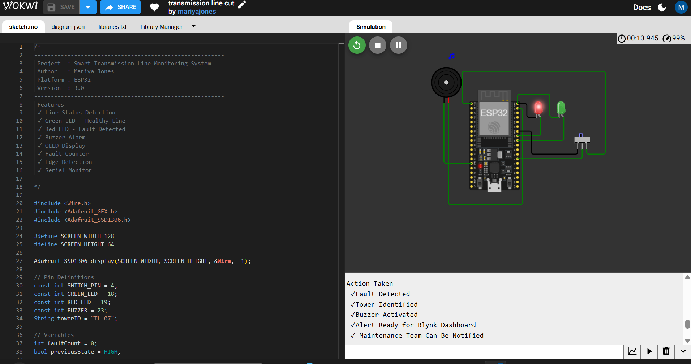
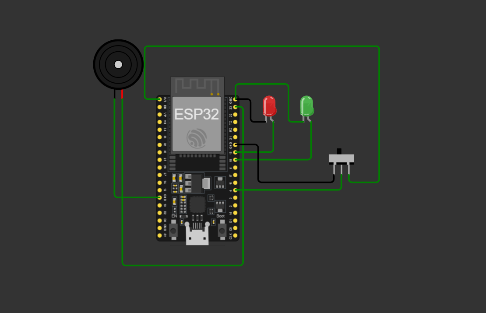
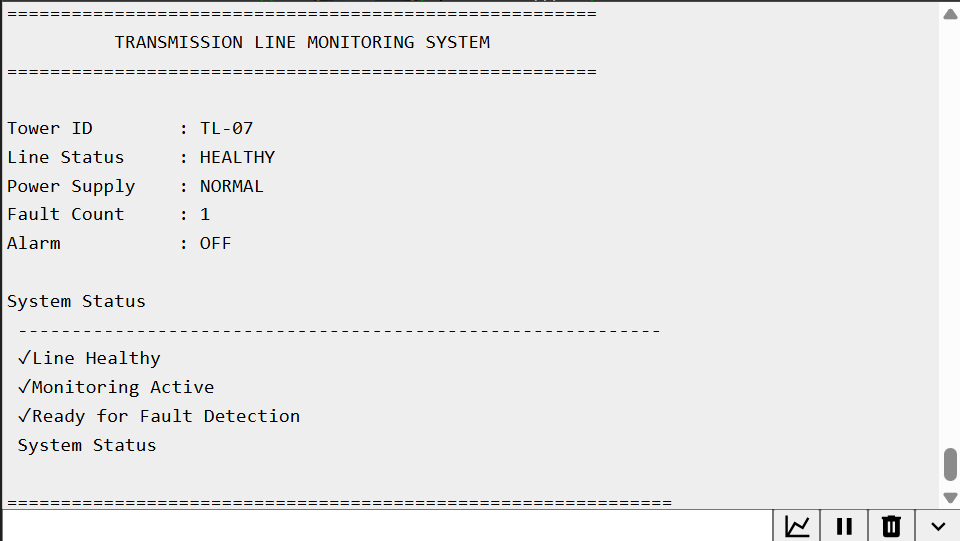
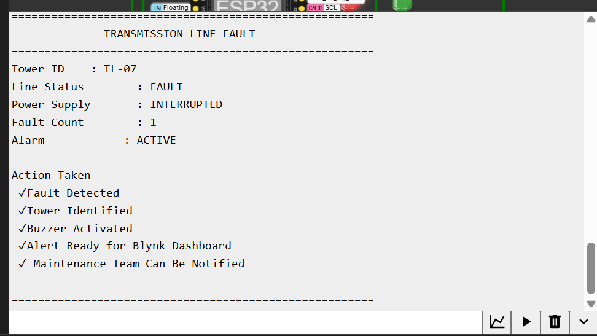

## Real-Time-Transmission-line-Monitoring-and-Fault-Detection-System-using-ESP32
ESP32-based prototype for real-time transmission line monitoring and fault detection with Tower ID-based fault localization, OLED display, alarm system, and Blynk IoT remote monitoring.
This project presents an ESP32-based prototype for monitoring transmission line health and detecting faults in real time. A slide switch is used in the Wokwi simulation to represent the output of current/voltage sensors. When a fault occurs, the system identifies the affected tower, activates an alarm, updates the fault counter, and displays the status on the Serial Monitor.
## Features
- Real-Time Transmission Line Monitoring
- Fault Detection
- Tower ID Identification (TL-07)
- Green LED for Healthy Line
- Red LED for Fault Condition
- Buzzer Alarm
- Fault Counter
- Professional Serial Monitor Dashboard
- Designed for Blynk IoT Integration
 ## 🛠️ Components Used
- ESP32 Development Board
- LEDs
- Active Buzzer
- Slide Switch
- Breadboard
- Jumper Wires
## Working Principle
1. The ESP32 continuously monitors the transmission line.
2. A slide switch simulates the output of current/voltage sensors.
3. During normal operation:
   - Green LED turns ON.
   - Alarm remains OFF.
   - Serial Monitor displays the healthy status.
4. During a fault:
   - Red LED turns ON.
   - Buzzer activates.
   - Tower ID is displayed.
   - Fault counter is incremented.
   - Serial Monitor displays the fault details
## Technologies Used
- ESP32
- Embedded C
- Arduino IDE
- Wokwi Simulator
- Serial Monitor
- GitHub
- Blynk IoT
## Future Improvements
- Replace the simulated slide switch with real current and voltage sensors.
- Implement a Blynk IoT dashboard for remote monitoring and fault notifications.
- Add GPS/GSM modules for accurate tower location tracking.
- Store fault history on a cloud platform for analysis and predictive maintenance.
- Extend the system to monitor multiple transmission towers simultaneously.
- Implement automatic fault isolation and restoration mechanisms.
- Develop a mobile application for real-time monitoring and maintenance alerts.
## Results
- Successfully monitored transmission line status using ESP32.
- Fault conditions were detected accurately using a simulated sensor.
- Tower ID-based fault localization was demonstrated.
- LED indicators and buzzer responded correctly during fault conditions.
- Serial Monitor displayed real-time system status and fault information.
## Note
This project currently uses a slide switch in Wokwi to simulate the output of current and voltage sensors. The architecture has been designed for future integration with the Blynk IoT platform for remote monitoring and alert notifications.
## Author
**Mariya Jones S**
Electronics and Communication Engineering Student
GitHub: https://github.com/MariyaJones-26
## Project Images
## Full Circuit

### Wokwi Circuit

---
### Healthy State

---
### Fault State

